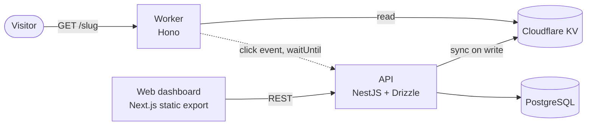

# Link Manager

> [!WARNING]
> **Discontinued. This repository is archived and no longer maintained.**
> I now use [Sink](https://github.com/ccbikai/Sink) for the same job. The code stays here for reference only. Please don't deploy it.

A small self-hosted URL shortener. Redirects are served from the edge by a Cloudflare Worker, and links are managed through a NestJS API and a Next.js dashboard.

## Goal

The project was an MVP. I built it to try out three things together:

- **Fast redirects at the edge.** The Worker reads the target URL straight from Cloudflare KV, so a redirect never waits on a database.
- **A clean split between the pieces.** Postgres holds the source of truth, and KV is only a read cache that the API keeps up to date.
- **Monorepo tooling.** One pnpm + Nx workspace, with each app versioned on its own through `nx release` and deployed by its own tag-triggered GitHub Actions workflow (`worker@*`, `web@*`, `api@*`).

## What it can do

- Create, list and delete short links (slug, target URL, optional title) from the web dashboard. The API can also update a link (`PATCH /links/:id`), but the dashboard has no UI for it.
- Redirect `/<slug>` to the target URL from the Worker, using KV.
- Update KV through the Cloudflare REST API whenever a link is created, updated or deleted.
- Log clicks in the background: the Worker sends slug, IP, country, city and user agent to the API, which stores them in Postgres.
- Return basic stats per slug from `GET /telemetry/:slug`: total clicks, clicks per country and per city, and the time of the last click. The dashboard doesn't show these.
- Show a QR code for each link in the dashboard.

## Architecture



| Path                     | Stack                                               | Deploy target (planned)          |
| ------------------------ | --------------------------------------------------- | -------------------------------- |
| `apps/worker`            | Hono on Cloudflare Workers, KV                      | Cloudflare Workers               |
| `apps/api`               | NestJS, Drizzle ORM, PostgreSQL                     | Docker image on a VPS, via GHCR  |
| `apps/web`               | Next.js App Router (`output: 'export'`), Tailwind v4, shadcn/ui | Cloudflare Pages     |
| `packages/shared-types`  | Shared TypeScript types (`Link`, DTOs, telemetry)   | –                                |

## Why it was discontinued

- **Sink already does this, and does it better.** Sink runs entirely on Cloudflare (Workers, KV and Analytics Engine), so it needs no server or database of my own. It also has a real analytics dashboard, link expiry and many other features this project never got.
- **The architecture was heavier than the problem.** On top of Cloudflare, this design needs a VPS, Postgres and Docker. Click events also travel from the edge back to that VPS, so the edge only speeds up the redirect itself, and any clicks that arrive while the API is down are lost.
- **It never got past the MVP.** Only the Worker was ever deployed. The API and the dashboard never went live.
- **The tooling experiment is done.** I've since used the Nx setup, independent versioning and tag-based deploys in other projects, and done them better there.

## Known limitations

Worth knowing if you read the code:

- The API has **no authentication** and no request validation, and CORS defaults to `*`.
- Redirects use `301`, which browsers cache. Repeat clicks from the same browser aren't logged, and changing a link's target may not reach returning visitors.
- The QR code encodes the target URL, not the short link, so its scans skip the Worker and aren't counted.
- The Worker ignores failed telemetry requests, and a failed KV sync only gets logged on the API side.
- The Worker's `API_BASE_URL` is still a placeholder, and the Worker's custom domain route has been removed on purpose, because that domain now serves something else.

## Running locally

Unmaintained, but this is how it was run:

```bash
pnpm install
docker compose up -d                  # Postgres (+ pgAdmin on :5050)

cp apps/api/.env.example apps/api/.env      # fill in the Cloudflare values
cp apps/web/.env.example apps/web/.env.local
(cd apps/api && pnpm exec drizzle-kit migrate)

pnpm dev:api      # http://localhost:3001
pnpm dev:web
pnpm dev:worker   # wrangler dev
```
